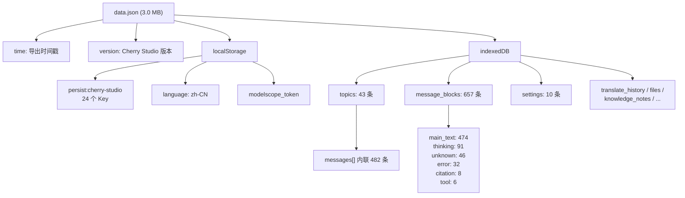
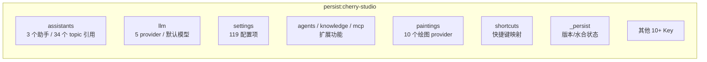
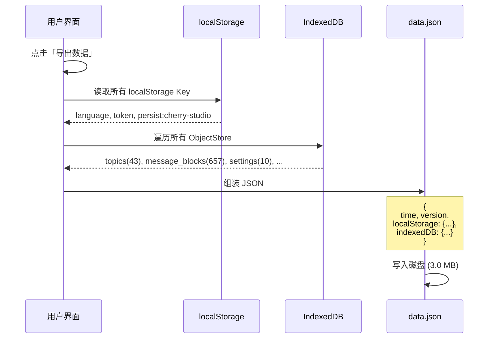
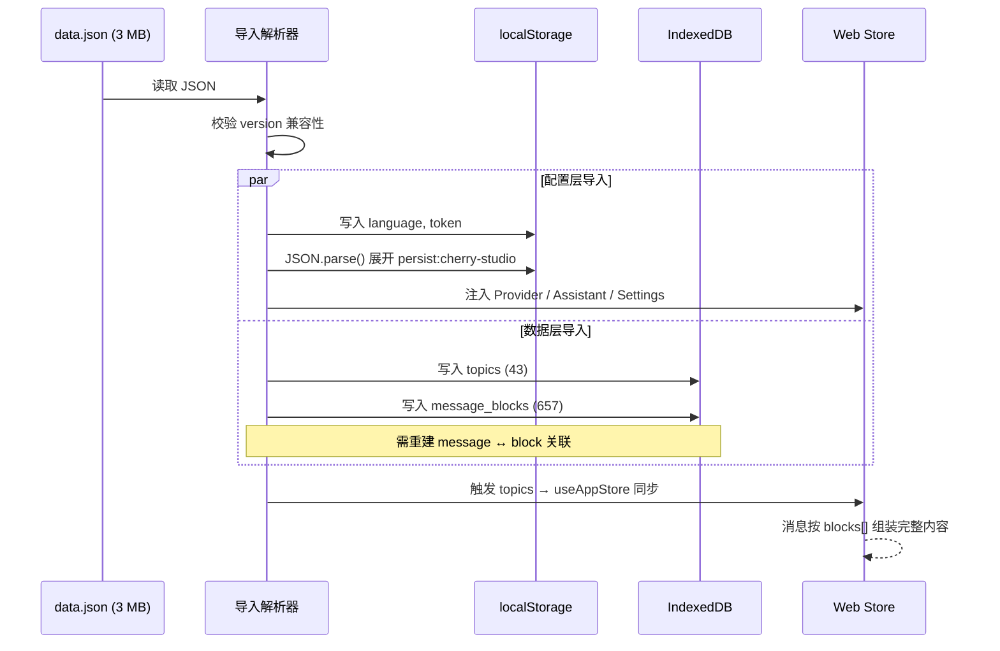
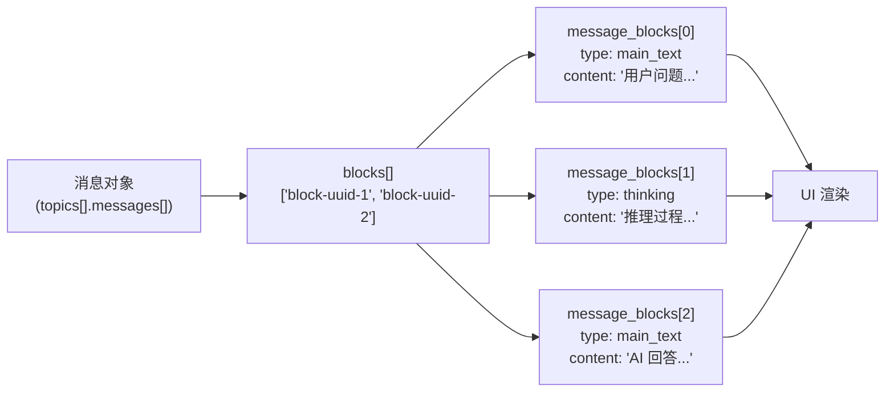

---
AIGC:
    Label: "1"
    ContentProducer: 001191440300708461136T1XGW3
    ProduceID: d270bcd3df6a2cd27c2792fa9a0b45ef_526f6e7a93df11f1bafa525400287e28
    ReservedCode1: sn9sCYQI2Fmg4w8Ca3aLZ6J/lp32wsaw5aPgFnFMJJ6u2fpBRyfOet7z0+b4A2syFGJ2bwjaw74AGnTJYmBumvrIE6yvc1CUy14o668O0W4xi17VDJHiL8EpiFhhU1cqnGH51ZNfk6Ia2bo2Vac4O8Rzprvfg/gvUmsR5GVZXm+Bl0ZJN6JUPkOps+g=
    ContentPropagator: 001191440300708461136T1XGW3
    PropagateID: d270bcd3df6a2cd27c2792fa9a0b45ef_526f6e7a93df11f1bafa525400287e28
    ReservedCode2: sn9sCYQI2Fmg4w8Ca3aLZ6J/lp32wsaw5aPgFnFMJJ6u2fpBRyfOet7z0+b4A2syFGJ2bwjaw74AGnTJYmBumvrIE6yvc1CUy14o668O0W4xi17VDJHiL8EpiFhhU1cqnGH51ZNfk6Ia2bo2Vac4O8Rzprvfg/gvUmsR5GVZXm+Bl0ZJN6JUPkOps+g=
---

# Data Architecture — Cherry Studio 数据架构分析

> 基于 `data.json`（3.0 MB / 3,174,637 bytes）的完整数据结构逆向分析。
> 源：Cherry Studio 导出格式。目标：为 Web 端数据架构改造提供参考。

---

## 1. 顶层结构



**文件大小分布估算**：

| 存储区域 | 包含内容 | 估算占比 |
|----------|---------|---------|
| indexedDB.topics | 43 个 topic + 482 条内联消息 | ~85% |
| indexedDB.message_blocks | 657 个内容块 | ~10% |
| localStorage | 24 个配置 Key | ~5% |

---

## 2. localStorage 子树

### 2.1 顶层

```
localStorage
├── language: "zh-CN"
├── modelscope_token: string
└── persist:cherry-studio  ← 核心配置字典（JSON 序列化）
```

### 2.2 persist:cherry-studio 内部结构（24 个 Key）



### 2.3 关键字段详解

#### assistants

```json
{
  "defaultAssistant": "uuid",
  "assistants": [
    {
      "id": "uuid",
      "name": "助手名称",
      "prompt": "系统提示词",
      "topics": ["topic-uuid-1", "topic-uuid-2", ...],
      "model": "deepseek-chat",
      "temperature": 0.7,
      "createdAt": "ISO 日期"
    }
  ]
}
```

| 字段 | 说明 |
|------|------|
| `defaultAssistant` | 默认助手 ID |
| `assistants[]` | 助手数组（3 个） |
| `assistants[].topics` | **仅含 topic ID 引用**，真实 messages 在 indexedDB |
| 总计 topic 引用 | 34 个（存在重复：同一 topic 可被多个助手引用） |

#### llm

```json
{
  "defaultModel": "model-id",
  "providers": [
    {
      "id": "uuid",
      "type": "deepseek / openai / ...",
      "apiKey": "sk-...",
      "apiHost": "https://api.deepseek.com",
      "models": [{ "id": "deepseek-chat", "name": "DeepSeek-V3" }],
      "enabled": true
    }
  ]
}
```

| 字段 | 说明 |
|------|------|
| `defaultModel` | 当前默认模型 ID |
| `providers[]` | Provider 配置数组（5 个） |
| `providers[].apiKey` | **明文存储** API Key（安全风险） |

#### settings（119 项，选列）

| 类别 | 配置项示例 |
|------|-----------|
| 主题 | `theme`, `fontSize`, `language`, `fontFamily` |
| 界面 | `sidebarWidth`, `showThinking`, `compactMode` |
| 快捷键 | `sendMessage` 等 |
| 导出 | `exportFormat` |
| 同步 | `webdav`, `nutstore` 配置 |
| 网络 | `proxy`, `timeout` |
| 隐私 | `telemetry`, `autoClear` |

#### 其他 Key 概览

| Key | 用途 | 数据量 |
|-----|------|--------|
| `agents` | AI Agent 配置 | 少量 |
| `knowledge` | 知识库配置 | 少量 |
| `mcp` | MCP 工具配置 | 少量 |
| `minapps` | 小程序配置 | 少量 |
| `websearch` | 搜索引擎配置 | 少量 |
| `paintings` | 绘图 Provider（10 个） | 中等 |
| `shortcuts` | 全局快捷键映射 | 少量 |
| `codeTools` | 代码工具配置 | 少量 |
| `memory` | AI 记忆配置 | 少量 |
| `translate` | 翻译引擎配置 | 少量 |
| `note` | 笔记配置 | 少量 |
| `ocr` | OCR 配置 | 少量 |
| `inputTools` | 输入增强工具 | 少量 |
| `preprocess` | 预处理配置 | 少量 |
| `copilot` | Copilot 配置 | 少量 |
| `selectionStore` | 文本选择行为 | 少量 |
| `nutstore` | 坚果云同步 | 少量 |
| `_persist` | Pinia 持久化元数据 | 1 条 |

---

## 3. indexedDB 子树

### 3.1 ObjectStore 总览

| ObjectStore | 记录数 | 用途 |
|-------------|--------|------|
| `topics` | 43 | 会话话题（含内联消息） |
| `message_blocks` | 657 | 消息内容块（细粒度拆分） |
| `settings` | 10 | 图片生成 Provider / 翻译设置 |
| `translate_history` | 2 | 翻译历史 |
| `files` | 0 | 空 |
| `knowledge_notes` | 0 | 空 |
| `quick_phrases` | 0 | 空 |
| `translate_languages` | 0 | 空 |
| `notes_tree` | 0 | 空 |

### 3.2 topics 结构

```
topics (43 条)
└── 每条:
    ├── id: string (UUID)
    ├── title: string (自动生成或手动命名)
    ├── assistantId: string
    ├── createdAt: ISO 日期
    ├── updatedAt: ISO 日期
    ├── messageCount: number
    ├── pinned: boolean
    └── messages[]: 内联消息数组 (总计 482 条)
         └── 每条消息:
             ├── id: string
             ├── role: "user" | "assistant" | "system"
             ├── topicId: string
             ├── assistantId: string
             ├── modelId: string
             ├── model: string (模型名，如 "deepseek-chat")
             ├── createdAt: ISO 日期
             ├── status: "complete" | "streaming" | "error" | "stopped"
             ├── blocks[]: string[] (内容块 ID 数组)
             ├── mentions: string[]
             └── usage: { promptTokens, completionTokens, totalTokens }
```

**关键字段**：
- `blocks[]` — 消息不直接存内容，而是通过 block ID **引用** `message_blocks` 中的内容块
- `role` — 标准对话角色（user / assistant / system）
- `model` + `modelId` — 记录生成此消息的模型

### 3.3 message_blocks 结构

```
message_blocks (657 条)
└── 每条:
    ├── id: string (被 messages[].blocks[] 引用)
    ├── messageId: string (回指到 topics[].messages[].id)
    ├── type: block_type (见下方分类)
    ├── content: string (实际文本内容)
    └── createdAt: ISO 日期
```

**block_type 分类**：

| 类型 | 数量 | 说明 |
|------|------|------|
| `main_text` | 474 | 用户/AI 的主要文本内容 |
| `thinking` | 91 | AI 思考过程（推理链） |
| `unknown` | 46 | 类型标记异常或未识别 |
| `error` | 32 | 错误信息 |
| `citation` | 8 | 引用/来源 |
| `tool` | 6 | 工具调用/结果 |

**总数**: 657

### 3.4 settings 结构

```
settings (10 条)
├── 图片生成 Provider 配置（约 8 条）
├── 翻译语言对配置
├── 置顶模型列表
└── 其他应用级设置
```

与 `localStorage.settings`（119 项）不同，`indexedDB.settings`（10 条）存储的是**与数据绑定**的配置（如图片生成的多个 Provider、翻译历史），而非纯 UI 偏好。

---

## 4. 数据流分析

### 4.1 导出流程（Cherry Studio → data.json）



### 4.2 导入流程（data.json → Web 端改造版）



### 4.3 消息组装流程



**设计意图**：一条消息可包含多个 block（如先思考、再回答），前端按 `blocks[]` 顺序组装渲染。

---

## 5. 已发现的结构问题

### 5.1 双重消息存储（严重）

| 问题 | 描述 |
|------|------|
| **现象** | messages 既在 `topics[].messages[]` 内联，又在 `message_blocks[]` 中作为独立记录存在 |
| **影响** | 数据冗余、写入可能不一致、导出体积增大 |

```
topics[0].messages[0].blocks = ["block-1", "block-2"]
                                  │           │
                                  ▼           ▼
                        message_blocks[0]   message_blocks[1]
                        (id: block-1)       (id: block-2)
```

实际上这是**引用分离**设计而非冗余：消息存元数据、block 存内容。但 topics 内联 messages 数组导致 topic 自身已包含大部分数据，message_blocks 成为额外的分片层。两者边界模糊。

### 5.2 32 个孤立 block（中等）

| 问题 | 描述 |
|------|------|
| **现象** | message_blocks 中有 32 条记录，其 `messageId` 在所有 topics 的 messages 中找不到对应 |
| **影响** | 导入后这些 block 无法渲染，占用存储且无法清理 |

可能原因：消息被删除但关联的 block 未被级联清理。

### 5.3 多层 JSON 嵌套（中等）

| 问题 | 描述 |
|------|------|
| **现象** | `localStorage.persist:cherry-studio` 的值是对整个 Pinia store 的 JSON 序列化，其中某些字段（如 settings）自身又是 JSON 字符串 |
| **影响** | 解析时需 `JSON.parse()` 两次；不同嵌套层级的数据完整性校验困难 |

### 5.4 单文件全量导出（严重）

| 问题 | 描述 |
|------|------|
| **现象** | 导出为单文件 3 MB，每次全量 |
| **影响** | 无法增量导出、无法按话题导出、大文件传输/处理成本高 |

### 5.5 存储分裂（严重）

| 问题 | 描述 |
|------|------|
| **现象** | 配置在 `localStorage`（有 5 MB 限制）、数据在 `IndexedDB`（容量更大），两个独立体系 |
| **影响** | 配置和数据需要跨存储查询、备份/恢复需要同时处理两个存储、localStorage 可能撑爆 |

### 5.6 assistants 元数据与数据分离（中等）

| 问题 | 描述 |
|------|------|
| **现象** | `localStorage.assistants[].topics` 仅含 topic ID 引用，实际 topic 数据（含 messages）在 indexDB.topics |
| **影响** | 读取"某助手下有多少条消息"需跨存储查询；导入时需先写入 indexedDB 再重建 localStorage 引用 |

---

## 6. 结构评估

| 维度 | 评分 | 说明 |
|------|------|------|
| **可读性** | ⭐⭐⭐ | JSON 层级清晰，但 message ↔ block 关联需跳转 |
| **可导入性** | ⭐⭐ | 多层嵌套、存储分裂增加导入复杂度 |
| **可扩展性** | ⭐⭐ | 单文件全量导出不支持增量；localStorage 有容量天花板 |
| **数据完整性** | ⭐⭐ | 32 个孤立 block 表明缺少级联清理或数据一致性校验 |
| **安全性** | ⭐ | API Key 明文存储在多处 |

---

## 7. Web 端改造建议

### 7.1 统一存储到 IndexedDB

```
当前（分裂）：
  localStorage → Provider / Assistant / Settings 配置
  indexedDB    → topics / message_blocks / 数据

改造后（统一）：
  IndexedDB: cherry-studio-web
  ├── ObjectStore: config
  │   ├── providers
  │   ├── assistants
  │   └── settings
  ├── ObjectStore: topics
  │   └── { id, messages[] }
  └── ObjectStore: message_blocks
      └── { id, messageId, type, content }
```

**理由**：IndexedDB 无容量上限、支持事务、可建索引。localStorage 仅保留 `theme` 等少量启动关键配置。

### 7.2 扁平化 message 结构

```
当前：
  topic.messages[].blocks = ["block-id-1", "block-id-2"]  ← 引用
  message_blocks[id].content = "..."                       ← 实际内容

改造后：
  topic.messages[].content = "..."      ← 内容直接内联
  topic.messages[].thinking = "..."     ← 思考过程独立字段
```

**理由**：一条消息通常只有 1-2 个 block（main_text + 可选的 thinking），分片带来的引用开销大于收益。特殊块（citation、tool、error）作为独立字段保留。

### 7.3 分层导出

```
导出级别：
  L1: 仅配置（providers / assistants / settings）  → ~50 KB
  L2: 配置 + 话题列表（不含消息）                    → ~200 KB
  L3: 配置 + 话题 + 选定话题的消息                   → ~500 KB/话题
  L4: 全量（兼容 Cherry Studio 格式）                → ~3 MB
```

### 7.4 话题级导入

支持从 `data.json` 中按需导入单个话题，而非必须全量导入。

### 7.5 API Key 安全

- 导入时检测 `apiKey` 字段，默认清空并提示用户手动填入
- Web 端存储时加密（可选，基于环境变量 `ENCRYPTION_KEY`）

### 7.6 导入数据清理

导入 `data.json` 时执行：
1. 过滤 `message_blocks` 中 `messageId` 在所有 topic 中不存在的孤立记录（32 个）
2. 校验 `topics[].messages[].blocks[]` 中引用的 block ID 是否全部存在于 `message_blocks`
3. 对缺失引用做降级处理（标记 `unknown`）

### 7.7 Web 端推荐 Schema

```typescript
// 改造后的核心类型（与 data.json 兼容）
interface WebAppData {
  version: number
  providers: Provider[]          // 从 localStorage.llm.providers 迁移
  assistants: Assistant[]        // 从 localStorage.assistants 迁移
  settings: Settings             // 从 localStorage.settings 迁移
  topics: Topic[]                // 从 indexedDB.topics 迁移（content 内联）
}

interface Topic {
  id: string
  assistantId: string
  name: string
  createdAt: string
  updatedAt: string
  pinned: boolean
  messages: WebMessage[]         // content 直接内联，不再引用 message_blocks
}

interface WebMessage {
  id: string
  role: 'user' | 'assistant' | 'system'
  content: string                // 原 main_text block 内容
  thinking?: string              // 原 thinking block 内容
  citations?: Citation[]         // 原 citation block 内容
  status: string
  model: string
  usage?: TokenUsage
  createdAt: string
}
```

---

## 8. 兼容性映射

导入 `data.json` 时需执行以下转换：

| data.json 源 | Web 端目标 | 转换逻辑 |
|-------------|-----------|---------|
| `localStorage.persist:cherry-studio` | `IndexedDB.config` | `JSON.parse()` 展开 + 提取关键字段 |
| `localStorage.assistants` | `appStore.assistants` | 直接映射 |
| `localStorage.llm.providers` | `appStore.providers` | 直接映射 |
| `localStorage.settings` | `appStore.settings` | 提取与 Web 相关的子集 |
| `indexedDB.topics` | `appStore.topics` | 映射，内联 messages |
| `indexedDB.message_blocks` | `topics[].messages[].content/thinking` | 按 `blocks[]` 引用组装 → 内联 |
| `indexedDB.settings` | `appStore.settings`（追加） | 合并 |

---

> **文档版本**: v1.0 | **分析日期**: 2026-08-09 | **源文件**: data.json (3.0 MB, Cherry Studio 导出格式)
*（内容由AI生成，仅供参考）*
